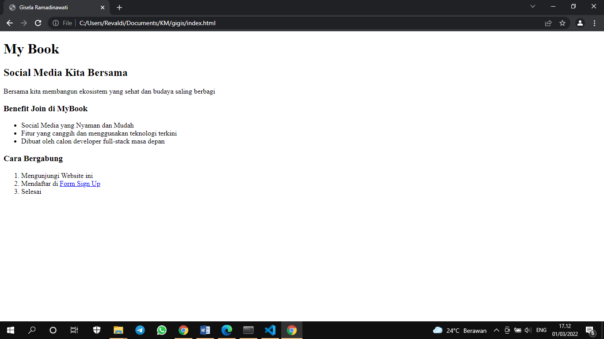
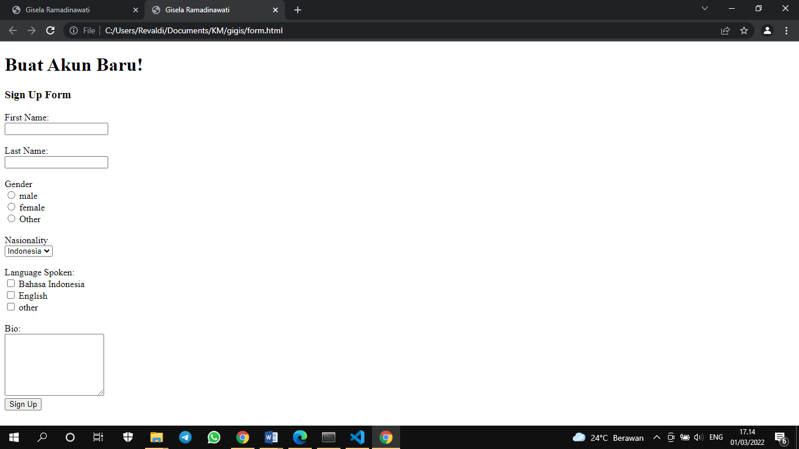
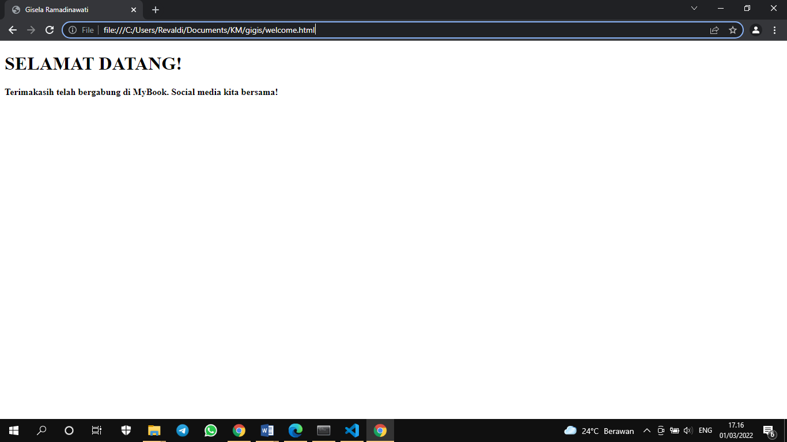

# 05 HTML

## Resume
1. Front-end developer
2. HTML
3. Membuat tampilan website sederhana 

Front-end developer
Adalah bagian dari website yang membuat tampilan yang menarik kepada user dengan membuat 3 bagian, diantaranta:
1. HTML
2. JS
3. CSS

HTML
Adalah sebuah standar yang digunakan secara luas untuk menampilkan halaman web.
Kegunaan HTML
1. Membuat struktur dari halaman website.
2. Mengatur tampilan dan isi dari halaman web.
3. Membuat tabel dengan tag html table.
4. Membuat form HTML.
5. Membuat gambar dengan canvas.
6. Mempublikasikan halaman website secara online
Dokumen HTML:
1. <! DOCTYPE >	: mendefinisikan dokumen ini sebagai HTML5
2. < html >		: elemen root dari halaman HTML
3. < head >		: berisi informasi meta tentang dokumen
4. < title >	: menentukan judul untuk dokumen
5. < body >		: berisi konten halaman yang terlihat.
  
List HTML
1.	Ordered List adalah list yang berurut. ( < al > )
2.	Unordered List adalah list yang tak berurut ( < ul > )  
Setiap item pada Ordered List dan Unordered List dideklarasikan menggunakan tag < li >
Tag Table HTML
1. Membuat table pada HTML menggunakan tag <table></table>
2. Setiap baris table di deklarasikan menggunakan <tr></tr>
3. Setiap kolom table di deklarasikan menggunakan <td></td>
4. Untuk kolom pada tabel header menggunakan <th></th>

## Task
### 1. Membuat Jembatan
Pada task ini, membuat jembatan hasil dari pembelajaran proses concurrent yang dilakukan pada Go.

Berikut kode hasil dari praktikum ini.

[index.go](./praktikum/index.go)

[form.go](./praktikum/form.go)

[welcome.go](./praktikum/welcome.go)

output:

